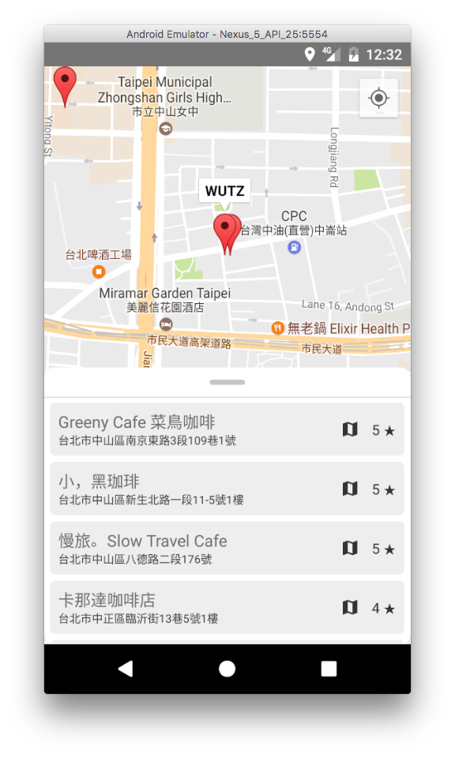

# CafeNomad App


臺灣工作咖啡廳地圖，感謝 https://cafenomad.tw 提供 API 給人亂打 :sweat_smile:

## Screenshots



## Development

```bash
npm install -g yarn
yarn
```

### iOS

(TODO, start react-native packager)

### Android

建立 `android/app/src/main/res/values/secrets.xml` 並填入以下內容：

```xml
<?xml version="1.0" encoding="utf-8"?>
<resources>
    <string name="google_maps_api_key">YOUR_GOOGLE_API_KEY_HERE</string>
</resources>
```

到 [Google API Console](https://console.developers.google.com/flows/enableapi?apiid=maps_android_backend) 申請你自己的 Google Map API Key。
